# Writeup: LFI and RFI Vulnerabilities (TryHackMe)
**Author:** Kiwi20003  
**Date:** 15/04/2026 
**Platform/Room:** [File inclusion](https://tryhackme.com/room/fileinc)
---
## 0. Introduction
 In this write-up, I will detail the tools and methodologies used to exploit **Local File Inclusion (LFI)** and **Remote File Inclusion (RFI)** vulnerabilities. 
 
The overview covers:
* **Basic Path Traversal:** Understanding directory navigation.
* **More advanced techniques** Using **Burp Suite** for intercepting and manipulating requests. 


  ---
  

## 1. Laboratory Details
| Target | Information |
| :--- | :--- |
| **Tools Used** | Burp Suite |
| **Difficulty** |  Medium | 

---

## 2. Explaining the vulnerabilities


* **Path Traversal:** Also known as directory traversal, this technique involves using `../`  sequences to navigate the server's file system and access files outside the web root directory.
* **Local File Inclusion (LFI):** This vulnerability occurs when an application includes a local file without proper sanitization. It allows an attacker to read sensitive files (like `/etc/passwd`) or execute local code.
* **Remote File Inclusion (RFI):** A more critical variant that allows the inclusion of files from **remote servers**. And can lead to the risk of **Remote Code Execution (RCE)**.

---

## 3. Reconnaissance & Enumeration

Upon starting the machine, we were directed to the following page hosting the different labs:

 
```
http://MACHINE_IP/
```
---

### Lab 1 — Basic LFI

The exercise required us to read the contents of `/etc/passwd` on the target
server. Upon accessing the website, we were presented with a simple file input
field.

By inspecting the URL, i identified the `?file=` parameter as the injection
point. Since no sanitization was in place, i was able to pass a direct
absolute path as the value:

```
http://10.130.175.178/lab1.php?file=/etc/passwd
```

### Result
The server returned the full contents of `/etc/passwd`, confirming that the
application was including local files without any validation.
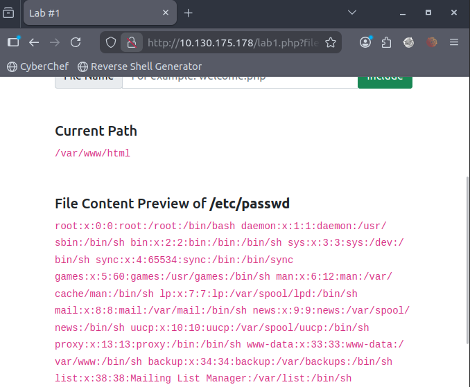

#### Why Does This Work?

This vulnerability works because everything written in the `?file=`
parameter is taken by the server and loaded directly into the page,
without any checks. The application just trusts whatever the user inputs
and includes that file in the response. This happens due to poor coding
practices and a lack of input sanitization.

 > **Note:** I got stuck for a while because I was typing `?lang=` instead of `?file=`, but after identifying the correct parameter it worked fine.


---
 ### Lab 2 — LFI with Path Traversal

#### Scenario

This lab introduced a subtle difference from Lab 1: the application
prepends the directory `includes/`  to whatever we enter in the `?file=`
parameter. The web does that by using the include function. The problem with that is that if we try to exploit it using the previous path, we won't be able to because we would be in /includes//etc/passwd 

#### Exploitation

When we enter the website we see the same as before, but when we enter the same path as before, we get the following include error:
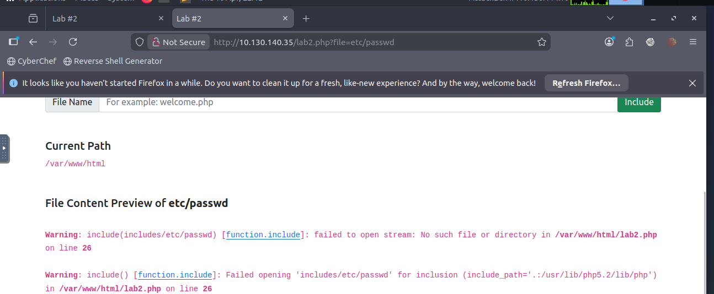

Upon reading it, we can see that it states that the application is forcing our input into the `includes/` directory, and that is why the contents of  `/etc/passwd` are not displayed.

Bypassing this restriction is straightforward; what we have to do is use a relative path. On the previous error page, we read that we are in `/var/www/html`, and since we are forced to be in `includes/`, the full path becomes `/var/www/html/includes/`. So, to escape, we will have to type `../../../../etc/passwd`.

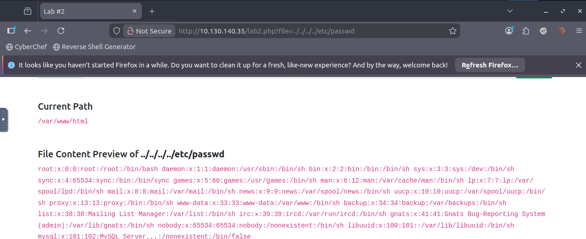

As you can see, by using the relative path to exit `/var/www/html/includes/` we were able to enter and view the requested content.

> **Note:** It's not necessary to use `../` in this exercise since the module asks for the directory specified in the include function, but  I wanted to demonstrate it here so we can see how to escape that directory — as we will need this technique in later labs.
---

## Lab 3 — LFI using NullBytes

#### Scenario 

In this lab, we are introduced to null bytes  (`%00`), which are used to ignore anything that comes after them. For example, if the application forces a `.php` extension and we are putting  `/etc/passwd%00.php`, instead of forcing `.php` at the end of the path and showing `/etc/passwd.php`, nothing will appear because it will be ignored.

#### Exploitation

Upon entering this lab, I saw the same interface as in the previous two, so the first thing I did was write `../../../../etc/passwd` in the web form. When I did that, an error popped up, and upon reading it, I realized that the website was forcing the `.php` extension at the end of the route.

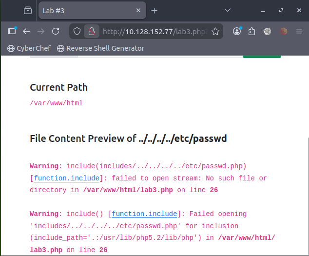

This gives us a lot of information, since we know that the website forces a PHP extension, and we know that by using nullbytes we can bypass that filter.

So I changed the path to `../../../../etc/passwd%00` and when I put it in the URL:

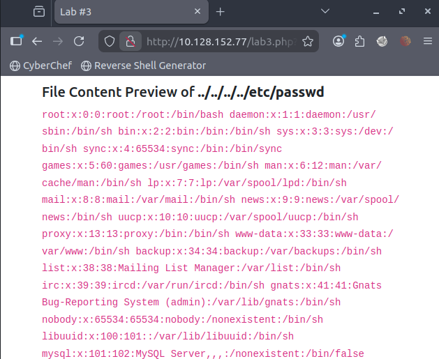

> **Note:** This technique only works on PHP versions older than 5.3.4, as later versions patched this behaviour.


---

## Lab 4  — Discover what function is using.

#### Scenario

This lab only asks us to identify which PHP function is causing the
directory traversal vulnerability. However, I'll use it as an opportunity
to also explore a couple of bypass techniques we haven't seen yet.

#### Exploitation

As usual, I started by trying `../../../../etc/passwd` in the input field.
This time though, the path seemed to be filtered, and the contents of the
file were not returned..
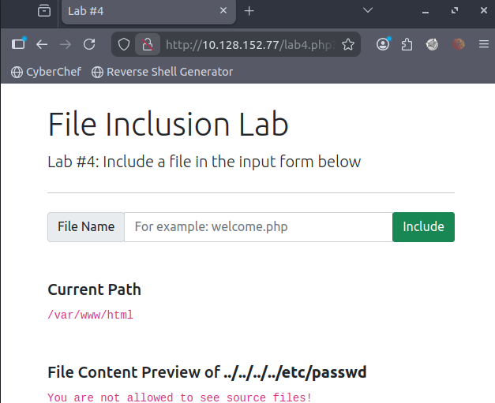

Upon seeing this, i realized that this path is filtered, which is why i cannot see the content. I added a nullbyte at the end to try to bypass it.

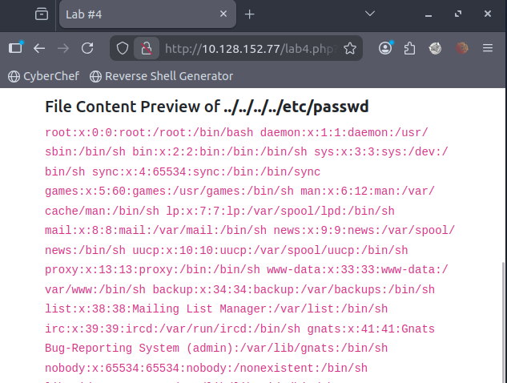

Using nullbytes lets you see the contents, but using ../../../../etc/passwd/. also works.

This was to view the content, but to answer the question, simply entering an invalid parameter is sufficient.  

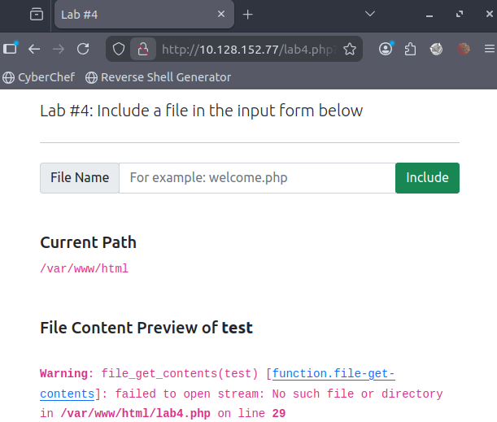

The answer is file_get_contents.

--- 

## Lab 5  — Input Validation

#### Scenario

This lab doesn't have questions, but i wanted to complete it as well to explain it. In this lab, we'll look at input validation.

#### Exploitation

When we entered the lab, whe used the same path as always, which is `../../../../etc/passwd`, and when we entered it, We got this error.

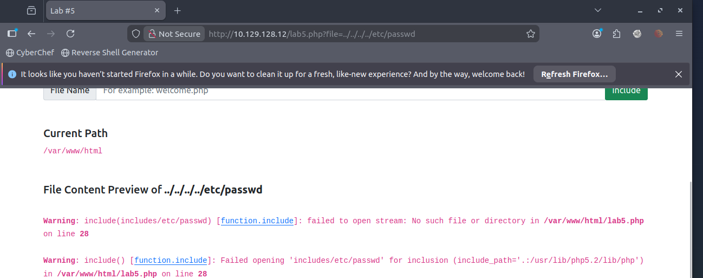

Upon reading the error, we can see that the `../` strings are removed because they are filtered and detected as malicious. To bypass this filter, it's quite easy: instead of using `../`, we will use `....//`, so the path will become `....//....//....//....//etc/passwd`.

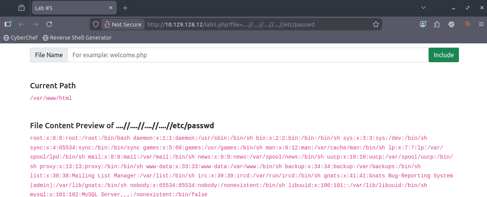


---
## Lab 6  — Identifying the OS

#### Scenario

This lab requires two things: first, to find the os-version, which we'll do by going to /etc/os-release; and second, to specify which directory should be in the input field. This already gives us a clue about what we'll see.

#### Exploitation

Upon entering, When we entered the os-releases path, and by entering the os-releases path, we can see which directory we need to be in to view the content.

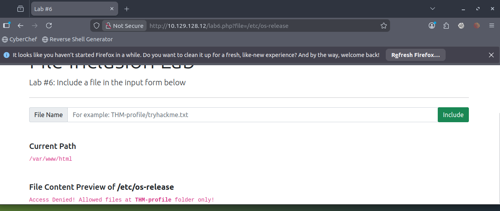

To bypass that, we will have to use the path ?`THM-profile/../../../../../etc/os-release` specifying that we are in ` THM-profile`.

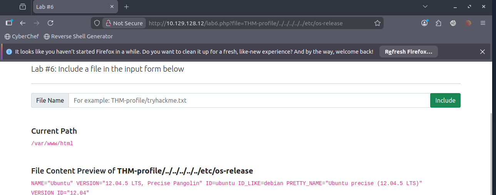

---

## Challenges
> **Note:** For these challenges we will be using Burp Suite and I must say that it was quite difficult for me since it was my first time using it.

## Challenge 1

#### Scenario
This lab requires us to find the contents of `/etc/flag1`, but not with any of the previous methods; instead, we need to use tools like  Burp Suite.

#### Exploitation
Upon entering the lab for the first time, we see that it still uses the same structure as before, but we can read that the input form is broken and that we need to send a `POST` request. This is a great clue, telling us where to begin.
 

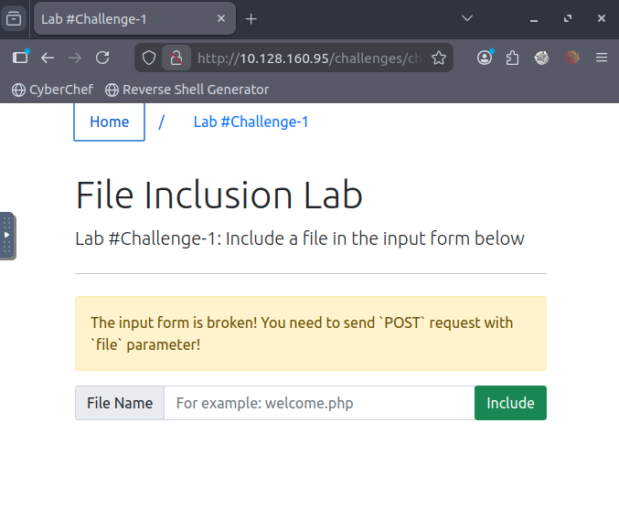

The first thing i do is set up the proxy and start intercepting traffic with Burp Suite
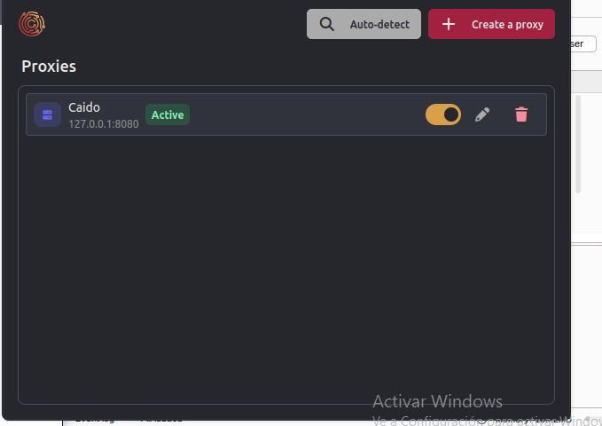
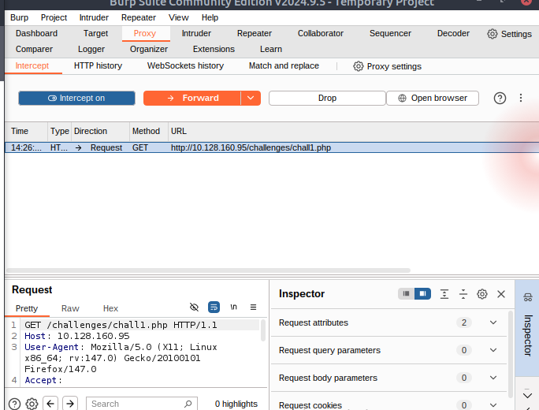

Upon intercepting, I realized that sending something in the form was sending a GET request. I sent it to the repeater, changed it to POST, and set the path to `/etc/flag1%00`

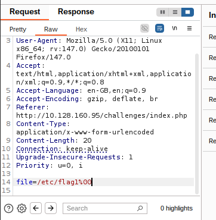

#### Result:
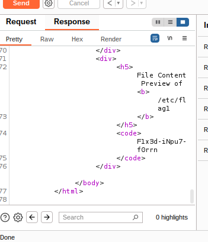

---

## Challenge 2

#### Scenario
This lab asks us to modify the cookies and find the blocked content on `/etc/flag2` to do that we will use Burp Suite

#### Exploitation

When we enter the website this time it's not like before; it tells us that we are guests and that we need to be admins to access it.

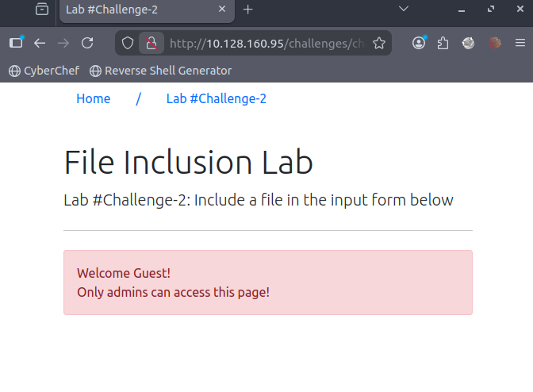


When intercepting, we see that we are also intercepting cookies. `User=THM` and `Value = Guest`, we pass it to the repeater and change the parameter from `GET` to `POST` and where it says value we put the path of the flag which in this case would be `../../../../etc/flag2` since we are in `/var/www/html`.
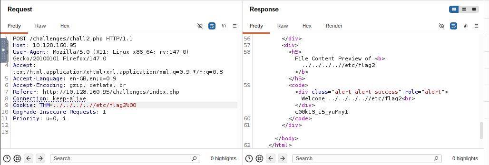

#### Result
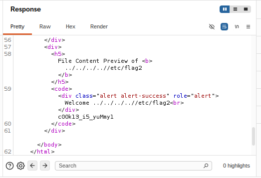

---
## Challenge 3

#### Scenario
This lab will teach us that even if one thing is filtered, something else may not be.
#### Exploitation

In this lab, when we logged in, I tried the URL and realized it was filtered and couldn't be used, so I intercepted traffic with Burp Suite.

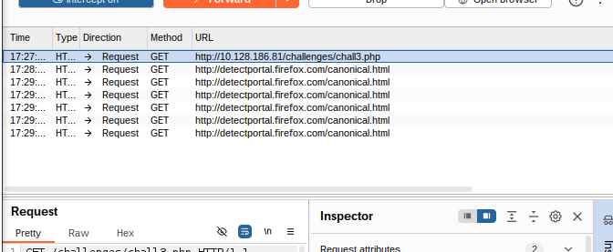

When intercepting traffic, I saw that a GET request was being sent. What I did was send it to the repeater, change it to POST, and put this path in `file=../../../../etc/flag3%00`. I included the nullbyte because otherwise, it adds `.php` and `../` to the end of the path. I added them because we were in `/var/www/html`.
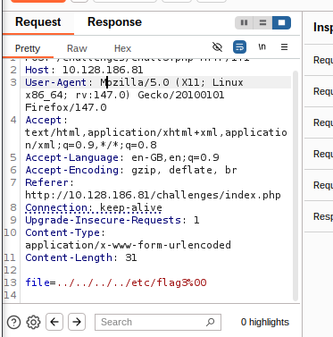
#### Result
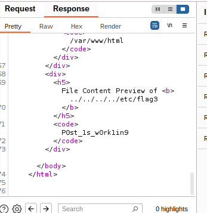


## Challenge 4 — Gain RCE with RFI

#### Scenario
In this lab, we are introduced to the RFI for the first time and are asked to win RCE and execute the hostname command.

#### Exploitation
The first thing I did was log in and start testing the website. I saw that when I changed the URL to `file=https`, an error popped up saying the host couldn't be resolved. That gave us a clue as to how to begin.
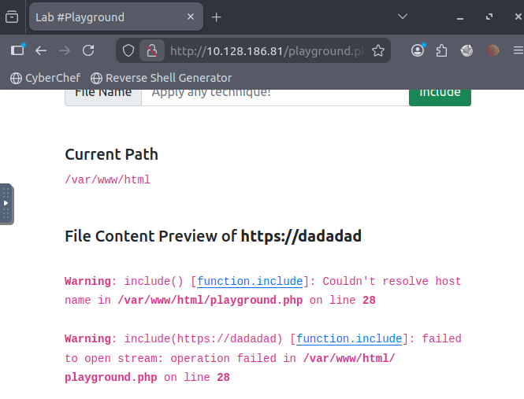

What I did was create a `PHP` script and upload it to an `HTTP` server, then put the server path in the lab URL.

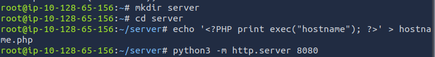

#### Result
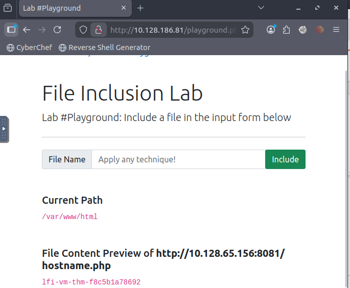